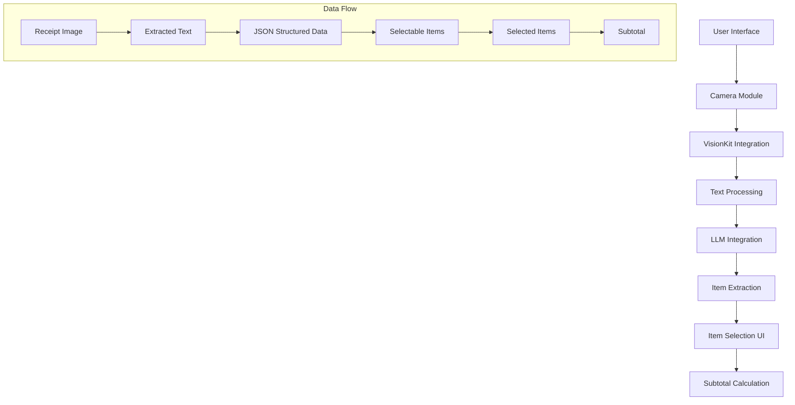
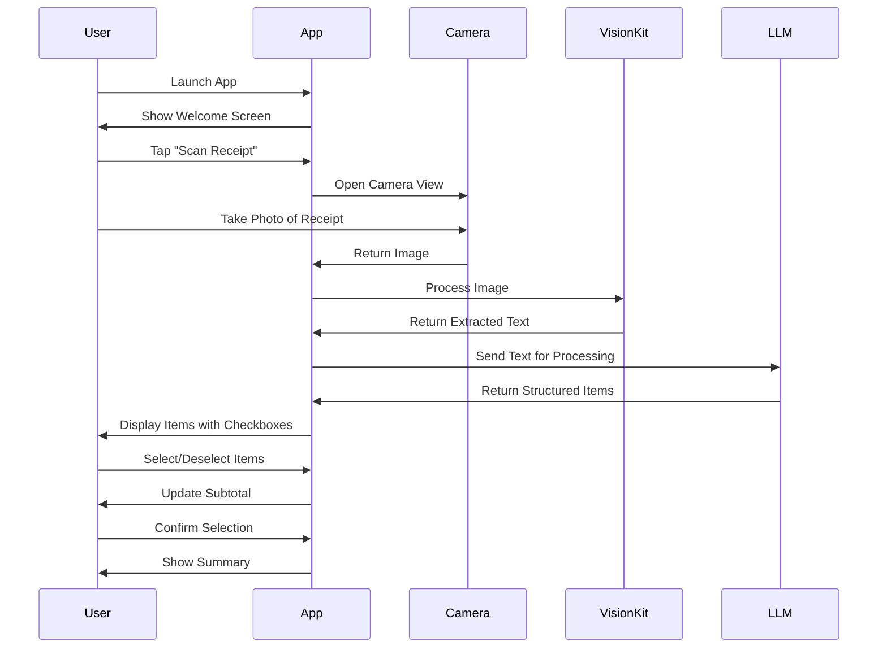

# Receipt Scanner & Bill Splitter App Architecture

## 1. Overview

The Receipt Scanner & Bill Splitter app is an iOS application that allows users to:
1. Take a picture of a receipt (e.g., from a bar or restaurant)
2. Use iOS VisionKit to extract text from the receipt
3. Process the text using a local LLM to identify individual items and prices
4. Present a list of items with checkboxes for users to select which ones they want to pay for
5. Calculate and display a running subtotal as items are selected

The app will use a single-flow experience that guides users through the process step by step, from scanning to item selection.

## 2. System Architecture



### Core Components:

1. **UI Layer**: SwiftUI views for the user interface
2. **Camera Module**: Integration with AVFoundation for camera access
3. **VisionKit Integration**: Text recognition from images
4. **LLM Integration**: Using the existing LLM.swift implementation
5. **Data Models**: Structures for receipt items and selection state
6. **Business Logic**: Item extraction and subtotal calculation

## 3. Data Models

```swift
// Receipt item model
struct ReceiptItem: Identifiable, Codable {
    var id = UUID()
    var label: String
    var amount: Double
    var isSelected: Bool = false
}

// Receipt model
struct Receipt: Identifiable, Codable {
    var id = UUID()
    var items: [ReceiptItem]
    var rawText: String
    var imageData: Data?
    var timestamp: Date = Date()
    
    var total: Double {
        items.reduce(0) { $0 + $1.amount }
    }
    
    var selectedTotal: Double {
        items.filter { $0.isSelected }.reduce(0) { $0 + $1.amount }
    }
}
```

## 4. UI Flow



### Screen Flow:

1. **Welcome Screen**: Initial screen with a button to start scanning
2. **Camera Screen**: Camera view for taking a picture of the receipt
3. **Processing Screen**: Loading indicator while processing the image
4. **Item Selection Screen**: List of extracted items with checkboxes and subtotal
5. **Summary Screen**: Final screen showing selected items and total

## 5. VisionKit Integration

The app will use iOS 17's VisionKit framework for text recognition from images. This includes:

1. **Live Text Analysis**: Real-time text recognition in the camera view
2. **Image Analysis**: Processing captured images to extract text
3. **Text Recognition**: Converting visual text to machine-readable format

```swift
// Example VisionKit integration
import VisionKit

class ReceiptScanner {
    func recognizeText(from image: UIImage) async throws -> String {
        guard let cgImage = image.cgImage else {
            throw NSError(domain: "ReceiptScannerError", code: 1, userInfo: [NSLocalizedDescriptionKey: "Failed to get CGImage from UIImage"])
        }
        
        let requestHandler = VNImageRequestHandler(cgImage: cgImage, options: [:])
        let request = VNRecognizeTextRequest()
        request.recognitionLevel = .accurate
        request.usesLanguageCorrection = true
        
        try requestHandler.perform([request])
        
        guard let observations = request.results else {
            return ""
        }
        
        return observations.compactMap { $0.topCandidates(1).first?.string }.joined(separator: "\n")
    }
}
```

## 6. LLM Integration

The app will use the existing LLM.swift implementation to process the extracted text and identify items and prices.

```swift
// Example LLM integration for receipt processing
extension Model {
    func extractReceiptItems(from text: String) async -> [ReceiptItem] {
        let prompt = """
        You are an assistant that extracts items and their prices from receipt text.
        
        Extract all items and their corresponding prices from the following receipt text.
        Return the result as a JSON array with objects containing "label" and "amount" fields.
        Only include actual items purchased, not subtotals, taxes, or totals.
        
        Receipt text:
        \(text)
        
        JSON response:
        """
        
        let response = await self.respond(to: prompt)
        
        // Parse JSON response
        if let jsonData = response.data(using: .utf8),
           let items = try? JSONDecoder().decode([ReceiptItem].self, from: jsonData) {
            return items
        }
        
        // Fallback parsing if JSON is not properly formatted
        return parseItemsManually(from: response)
    }
    
    private func parseItemsManually(from text: String) -> [ReceiptItem] {
        // Implement fallback parsing logic
        // This would extract items and prices using regex or other text processing
        return []
    }
}
```

## 7. Implementation Steps

### Phase 1: Project Setup and Basic UI

1. **Create New Screens**:
   - Welcome screen
   - Camera screen
   - Processing screen
   - Item selection screen
   - Summary screen

2. **Set Up Navigation**:
   - Implement navigation flow between screens
   - Add progress indicators

3. **Data Models**:
   - Implement ReceiptItem and Receipt models
   - Set up state management

### Phase 2: Camera and VisionKit Integration

1. **Camera Access**:
   - Implement camera permission requests
   - Create camera preview and capture functionality

2. **VisionKit Integration**:
   - Implement text recognition from images
   - Add support for Live Text analysis
   - Create text extraction service

3. **Image Processing**:
   - Add image preprocessing for better text recognition
   - Implement error handling for failed scans

### Phase 3: LLM Integration

1. **Prompt Engineering**:
   - Design effective prompts for item extraction
   - Test with various receipt formats

2. **LLM Service**:
   - Extend the existing Model class for receipt processing
   - Implement JSON parsing from LLM responses
   - Add fallback parsing for non-standard responses

3. **Error Handling**:
   - Implement retry mechanisms
   - Add user feedback for processing issues

### Phase 4: Item Selection UI

1. **Item List**:
   - Create a list view for extracted items
   - Implement checkboxes for selection

2. **Subtotal Calculation**:
   - Implement real-time subtotal updates
   - Add animations for selection changes

3. **UI Polish**:
   - Add loading indicators
   - Implement error states
   - Add empty states

### Phase 5: Testing and Refinement

1. **Unit Testing**:
   - Test text extraction
   - Test LLM processing
   - Test subtotal calculation

2. **Integration Testing**:
   - Test end-to-end flow
   - Test with various receipt types

3. **UI Testing**:
   - Test user interactions
   - Test accessibility

## 8. Technical Considerations

### Performance

1. **Image Processing**:
   - Optimize image capture for text recognition
   - Consider downsampling large images

2. **LLM Processing**:
   - Implement caching for processed receipts
   - Consider background processing for large receipts

### Privacy

1. **Data Storage**:
   - Store receipt data locally only
   - Implement data retention policies

2. **Camera Usage**:
   - Clear communication about camera usage
   - Proper permission handling

### Accessibility

1. **VoiceOver Support**:
   - Ensure all UI elements are accessible
   - Add descriptive labels

2. **Dynamic Type**:
   - Support dynamic type for text scaling
   - Test with various text sizes

## 9. Code Structure

```
ReceiptSplitter/
├── App/
│   ├── ReceiptSplitterApp.swift
│   └── AppDelegate.swift
├── Models/
│   ├── ReceiptItem.swift
│   └── Receipt.swift
├── Views/
│   ├── WelcomeView.swift
│   ├── CameraView.swift
│   ├── ProcessingView.swift
│   ├── ItemSelectionView.swift
│   └── SummaryView.swift
├── Services/
│   ├── ReceiptScanner.swift
│   ├── LLMService.swift
│   └── ImageProcessor.swift
├── Utils/
│   ├── Extensions.swift
│   └── Constants.swift
└── Resources/
    ├── Assets.xcassets
    └── Info.plist
```

## 10. Future Enhancements

1. **History Feature**:
   - Save past receipts and selections
   - Allow revisiting previous scans

2. **Sharing**:
   - Export selected items as text or image
   - Share with other users

3. **Multiple Selection Profiles**:
   - Allow saving different selection profiles
   - Support multiple users selecting items

4. **Receipt Categorization**:
   - Automatically categorize receipts
   - Track spending by category

5. **Enhanced Recognition**:
   - Improve recognition for handwritten receipts
   - Support for more languages and currencies